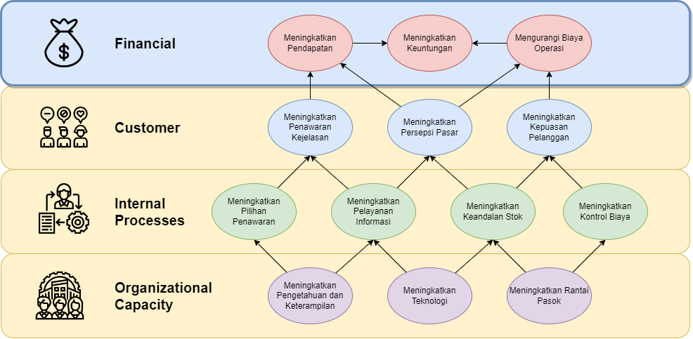

# Data Warehouse and Business Intelligence for Olist’s Finance and Customers

  

## 📌 **Domain Proyek**
Lorem ipsum odor amet, consectetuer adipiscing elit. Augue vivamus dictumst primis cursus feugiat venenatis interdum finibus. Tortor rhoncus elementum potenti tortor nisi, amet cras augue. Ac volutpat aenean posuere velit; pulvinar molestie porta. Consequat maecenas sapien rutrum posuere litora facilisi vitae ultricies dapibus. Feugiat porta dolor placerat duis vivamus maecenas. Potenti nisi cras aptent integer ut viverra, nibh sodales. Class porttitor et montes gravida egestas maecenas phasellus feugiat.

Nunc phasellus class congue potenti himenaeos. Primis tristique dis tristique neque enim nullam ornare turpis. Semper platea rhoncus vel bibendum montes dolor. Per et eros, ornare et montes id. Parturient nunc fusce aliquam vivamus; mi efficitur. Pulvinar penatibus himenaeos convallis nullam convallis pharetra fermentum. Malesuada accumsan molestie felis parturient et. Parturient sodales fusce fermentum finibus curae montes justo bibendum? Dignissim nibh mus; facilisi elit sollicitudin curabitur tempor.

## 🎯 **Business Understanding**
### **Latar Belakang**
- Lorem ipsum odor amet, consectetuer adipiscing elit. Augue vivamus dictumst primis cursus feugiat venenatis interdum finibus.
- Lorem ipsum odor amet, consectetuer adipiscing elit. Augue vivamus dictumst primis cursus feugiat venenatis interdum finibus.
- Lorem ipsum odor amet, consectetuer adipiscing elit. Augue vivamus dictumst primis cursus feugiat venenatis interdum finibus.

### **Tujuan Proyek**
1. Lorem ipsum odor amet, consectetuer adipiscing elit. Augue vivamus dictumst primis cursus feugiat venenatis interdum finibus.
2. Lorem ipsum odor amet, consectetuer adipiscing elit. Augue vivamus dictumst primis cursus feugiat venenatis interdum finibus.
3. Lorem ipsum odor amet, consectetuer adipiscing elit. Augue vivamus dictumst primis cursus feugiat venenatis interdum finibus.

## 🛠 **Solution Statements**
Untuk mencapai tujuan proyek, solusi yang diterapkan meliputi:
- **Arsitektur Data Warehouse** dengan pendekatan star schema atau snowflake schema.
- **ETL (Extract, Transform, Load)** menggunakan Pentaho BI Platform untuk mengintegrasikan data dari berbagai sumber.
- **Business Intelligence Dashboard** menggunakan Tableau dan Looker Studio untuk visualisasi data.
- **Analisis data pelanggan** dengan teknik data mining untuk memahami perilaku pelanggan.
- **Analisis keuangan** untuk mengidentifikasi pola transaksi dan optimasi strategi bisnis.

## 📊 **Data Understanding**
### **Sumber Data**
- **Data transaksi pelanggan** (orders, payments, shipping status, reviews).
- **Data keuangan** (revenue, cost, profit margin, refund rates).
- **Data demografi pelanggan** (lokasi, preferensi, frekuensi pembelian).

### **Struktur Data Warehouse**
| Nama Tabel | Deskripsi |
|------------|-----------|
| dim_customer | Data pelanggan (ID, nama, lokasi, segmentasi pelanggan) |
| dim_product | Data produk yang tersedia di Olist |
| dim_time | Data dimensi waktu (tahun, bulan, hari) |
| fact_orders | Data transaksi pesanan pelanggan |
| fact_finance | Data transaksi keuangan, termasuk revenue dan refund |

## 🏗 **Data Preparation**
1. **Data Cleaning**: Menghapus duplikasi, menangani missing values, dan memastikan konsistensi data.
2. **Transformasi Data**: Normalisasi dan agregasi data untuk pengolahan dalam Data Warehouse.
3. **Integrasi Data**: Penggabungan data dari berbagai sumber ke dalam satu repositori terpusat.
4. **Pengolahan ETL**: Mengotomatisasi proses Extract, Transform, Load menggunakan BI Platform.

## 📈 **Business Intelligence Implementation**
- **Dashboard Keuangan**: Memantau revenue, profit margin, refund rates.
- **Dashboard Pelanggan**: Menganalisis segmen pelanggan, tren pembelian, dan retensi pelanggan.
- **Laporan Kinerja Produk**: Mengidentifikasi produk dengan penjualan tertinggi dan terendah.

## 📝 **Evaluation & Analysis**
- **KPI Utama**: Revenue Growth, Customer Retention Rate, Profit Margin.
- **Analisis Tren**: Membandingkan performa keuangan dan pelanggan berdasarkan periode tertentu.
- **Prediksi Penjualan**: Menggunakan model prediktif untuk proyeksi pendapatan di masa depan.

## 🚀 **Kesimpulan & Next Steps**
### **Pencapaian**
- Data Warehouse berhasil dikembangkan dengan arsitektur yang efisien.
- Dashboard BI memberikan wawasan yang lebih dalam terhadap performa bisnis.
- Data pelanggan dan keuangan dapat dianalisis lebih akurat untuk mendukung keputusan strategis.

### **Potensi Pengembangan**
- Implementasi machine learning untuk rekomendasi produk berbasis perilaku pelanggan.
- Optimasi ETL pipeline agar lebih scalable dengan volume data yang lebih besar.
- Pengembangan sistem alert otomatis untuk mendeteksi anomali dalam data keuangan.

---
**📌 Teknologi yang digunakan:**
- **Data Warehouse:** MySQL, Google Cloud BigQuery
- **ETL Tools:** Pentaho BI Platform
- **Business Intelligence:** Tableau, Looker Studio
- **Machine Learning (untuk analitik lanjutan):** TensorFlow, Scikit-Learn

📍 **Contributor:** [Nama Anda]

📅 **Tanggal Pembuatan:** [Tentukan Tanggal]

